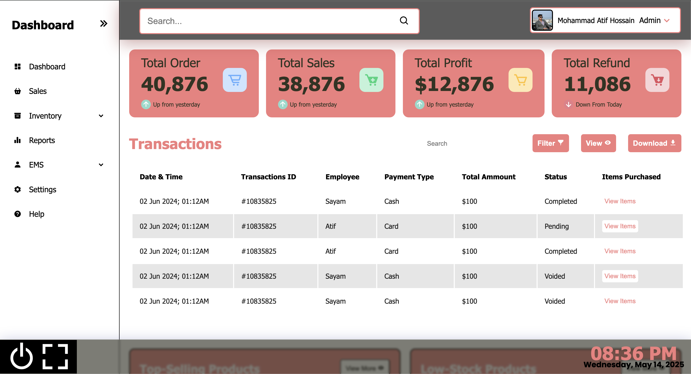

# Dashboard Management System



A comprehensive and responsive dashboard management system for tracking sales, inventory, employee performance, and business metrics.

## Features

- **Interactive Sidebar** with collapsible sub-menus
- **Overview Metrics** displaying key business indicators
- **Transaction Management** with filtering and export capabilities
- **Inventory Tracking** for top-selling and low-stock products
- **Employee Performance** monitoring with detailed metrics
- **Profit Analysis** with margin calculations
- **Responsive Design** works on desktop and mobile devices
- **Dark/Light Mode** (toggleable through CSS variables)

## Technologies Used

- **Frontend**: HTML5, CSS3, JavaScript
- **Icons**: Boxicons
- **Fonts**: Google Fonts (Poppins, Roboto, Open Sans, Noto Sans)
- **Styling**: CSS Grid, Flexbox
- **Responsive Design**: Media queries for various screen sizes

## Installation

1. Clone the repository:
   ```bash
   git clone https://github.com/MohammadAtifHossain/dashboard-management.git

2. Navigate to the project directory:
    ```bash
    cd dashboard-management
    
3. Open index.html in your preferred browser.

## File Structure

dashboard/ <br>
├── assets/<br>
│   ├── js/<br>
│   │   └── app.js          # Main JavaScript functionality<br>
│   ├── style/
│   │   └── style.css       # Main stylesheet<br>
│   └── image/              # Image assets<br>
├── index.html              # Main HTML file<br>
└── README.md               # Project documentation<br>

## Usage

 1. Navigation
    - Use the sidebar to navigate between different sections
    - Click the toggle button (☰) to collapse/expand the sidebar
    - Sub-menus can be expanded by clicking the dropdown arrows

 2. Features
    - **Search functionality** in the header
    - **Filter and export** options for transaction data
    - **Quick actions** buttons throughout the interface
    - **Fullscreen mode** available in the footer controls

## Customization

To customize the dashboard:

 1. **Colors**: Modify the CSS variables in style.css:
    ```bash
    :root {
    --base-clr: #ffffff;
    --line-clr: #000000;
    --hover-clr: #f05a5a;
    --text-cir: #000000;
    --accent-clr: #000000;
    --secondary-text-clr: #f27e7e;
    }

2. **Content**: Update the HTML files with your specific data and requirements.

3. **Icons**: Replace Boxicons with your preferred icon library by updating the CDN link in the HTML head.

## Browser Support

The dashboard is tested and works on:

- Chrome (latest)
- Firefox (latest)
- Edge (latest)
- Safari (latest)

## Contributing

Contributions are welcome! Please follow these steps:

1. Fork the project
2. Create your feature branch (git checkout -b feature/AmazingFeature)
3. Commit your changes (git commit -m 'Add some AmazingFeature')
4. Push to the branch (git push origin feature/AmazingFeature)
5. nOpen a Pull Request


This README provides:
1. Clear project overview
2. Feature highlights
3. Installation instructions
4. Usage documentation
5. Customization options
6. Contribution guidelines
7. Professional formatting

You may want to:
- Add actual screenshots by replacing the placeholder paths
- Update the contact information with your details
- Add a real license file if needed
- Include any additional deployment instructions if applicable


